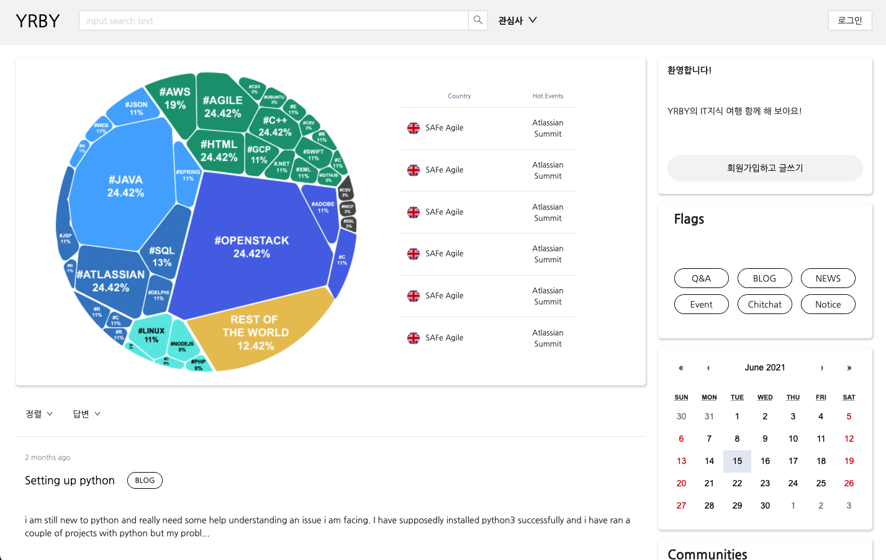

# Community flatform prototype

## 사용기술

 
 

## 제작 사유

- PI 리뷰때 사용할 커뮤니티 플랫폼의 일부 기능인 게시판, 댓글 부분의 시연을 위해 제작
- 제작 당시 백엔드 개발자 부재로 인해 직접 node.js, express, mongodb를 이용하여 api 제작
- 기능 구현으로 인해 UI는 antD를 사용

## 구현기능

- 게시판 글 작성, 수정, 삭제, 읽기 기능
- 해당 게시글의 댓글 작성, 수정, 삭제, 읽기 기능

## URL (Beta ver)

- [link](http://devitda.osci.kr:3000/)
